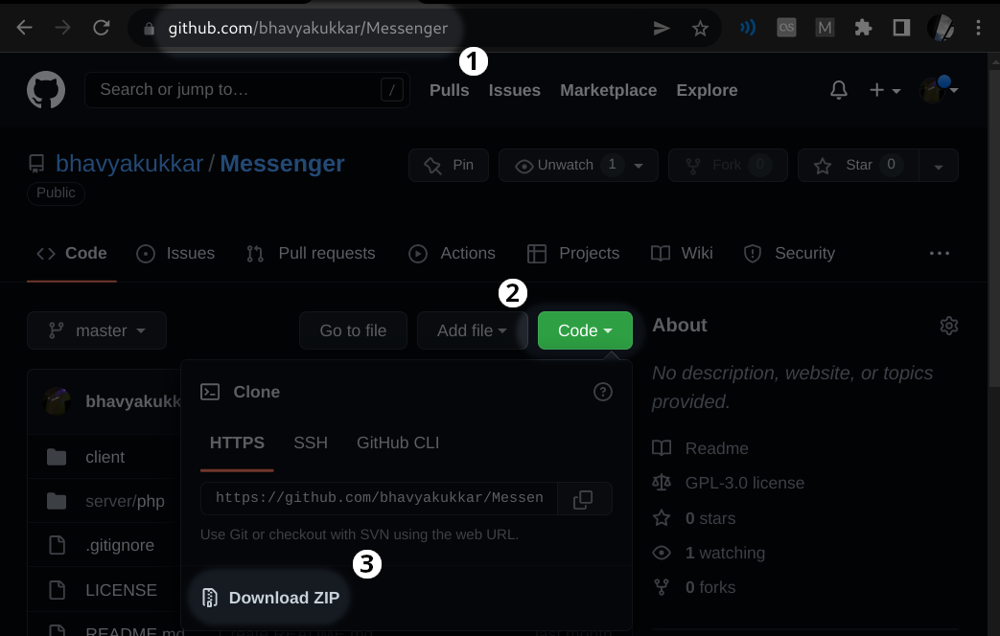
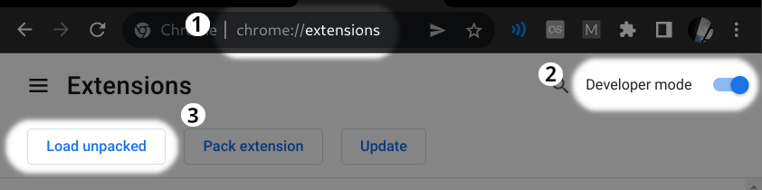
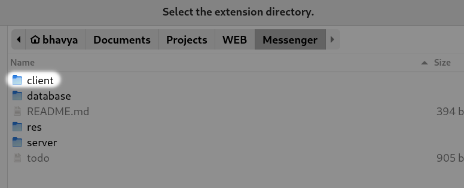

# Messenger

A standalone Messenger operating as a Google Chrome extension.

Steps to install:

> 1. Download the [repository](https://github.com/bhavyakukkar/Messenger):  
   

 

> 2. Find the 'Load Unpacked' option having Developer Mode enabled in your Chrome Extensions:  
   

 

> 3. Select the 'client' folder (*Messenger/client*) from the downloaded repository:  
   